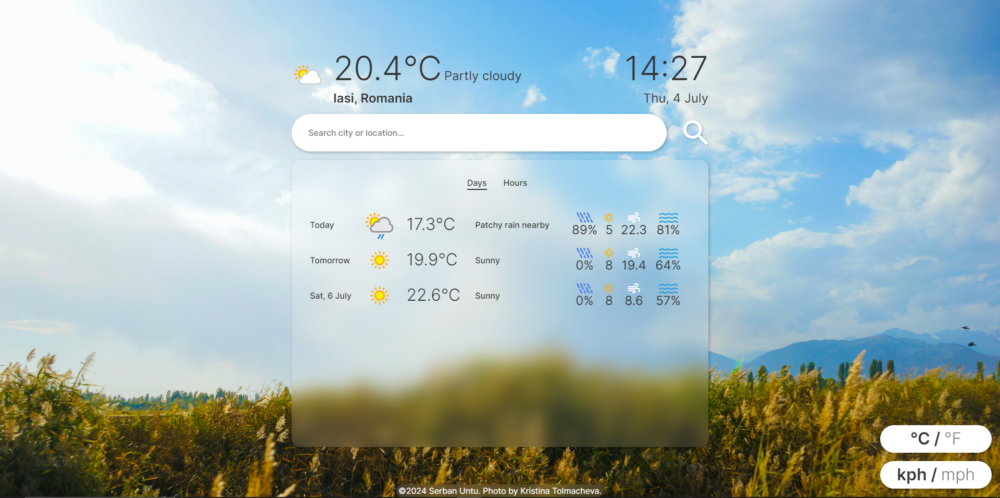

# WeatherWatch



## About

`WeatherWatch` is an app that allows you to view the current weather and the weather forecast at any location.

### Features

- A simple and intuitive display
- Accurate data from [WeatherAPI](https://www.weatherapi.com/) including: temperature, condition, chance of rain, UV index, wind speed and air humidity
- Weather information for every hour, up to 72 hours in the future
- A background image that updates to reflect the type of weather in the current location
- Buttons to choose between units (Celsius v. Fahrenheit and km/h over mph)

## What I learned

Enums are not available in vanilla JS, so I implemented them using `Symbol`s. I use them whenever I want to ensure an item of data is in one of multiple clearly-defined states (using normal `String`s can lead to errors).

```js
// enums.js
export class Category {
	static CLEAR = Symbol('Category.CLEAR')
	static CLOUDY = Symbol('Category.CLOUDY')
	static OVERCAST = Symbol('Category.OVERCAST')
	static RAINY = Symbol('Category.RAINY')
	static STORMY = Symbol('Category.STORMY')
	static SNOWY = Symbol('Category.SNOWY')
}

// api.js
static getCategoryFromConditionCode(code) {
	switch (code) {
		case 1000:
			return Category.CLEAR
		case 1003:
		case 1006:
			return Category.CLOUDY
		case 1087:
		case 1273:
		case 1276:
		case 1279:
		case 1282:
			return Category.STORMY
	 	// ...
	}
```

The condition code from the API response is used to determine the current category of weather, which is in turn used to find a suitable image to display as the background of the app. A table of condition codes is provided by `WeatherAPI`.

The `Image` class encapsulates all data related to an image: the theme of the page that ensures the best contrast, the source of the image after the build process, and the author(s) of the image, mentioned in the `credits` section.

```js
export const images = {
	'clear-day': new Image(ClearDay, 'Teddy Charti', Theme.LIGHT),
	'clear-night': new Image(ClearNight, 'Oskar Kadaksoo', Theme.DARK),
	'cloudy-day': new Image(CloudyDay, 'Kristina Tolmacheva', Theme.LIGHT),
	// ...
}
```

The data in the forecast menu which features two tabs, `Days` and `Hours`, is laid out as a `<table>` element, so the design fits the constraints and looks clean without any additional styling required.

Each row in the table is represented by an instance of the `DataRow` class, which makes building the actual table very simple. Here is part of the method that constructs a `<tr>` element from an instance:

```js
getComponent() {
	const tr = document.createElement('tr')
	tr.innerHTML = `
		<td><p>${this.name}</p></td>
		<td></td>
		<td><h2 class="row-temp">${this.temp}°${API.preferred.temp.toUpperCase()}</h2></td>
		<td><p class="text-ellipsis">${this.conditionText}</p></td>
		<td class="data-group data-rain" title="Chance of rain: ${this.rain}%">
			<div class="img-wrapper">
				
			</div>
			<h3>${this.rain}%</h3>
		</td>
		...
	`
	return tr
}
```

## Further development

Here is a list of features that could be added to take this app to the next level:

- Make the design responsive, so the app can be used on mobile devices
- Improve error messages
- Refactor the code so it is more readable
- Update the layout to use a grid instead of a table
